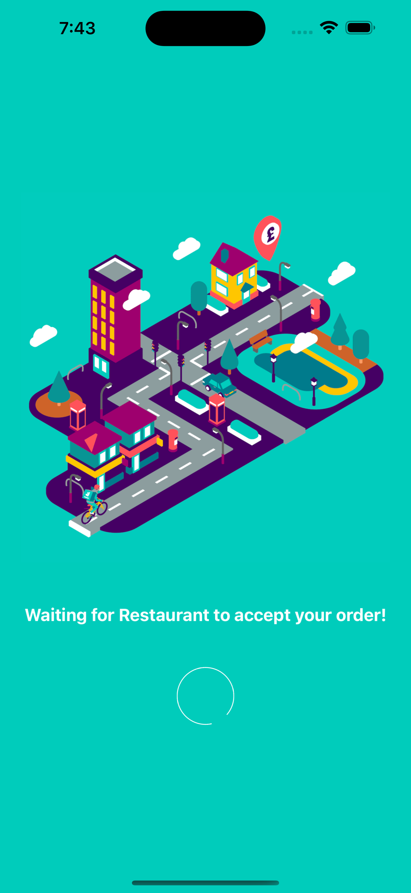

<h1 align="center">
  💻 Deliveroo Clone
</h1>

## 💼 Tecnologias utilizadas

iOS/Android React Native project of [Deliveroo](https://deliveroo.co.uk/). Built using REACT NATIVE with (Navigation, Redux, Tailwind CSS & Sanity.io)

# 🎯 Screenshots

&nbsp; &nbsp; &nbsp; &nbsp;&nbsp; &nbsp; &nbsp; &nbsp;

&nbsp; &nbsp; &nbsp; &nbsp;&nbsp; &nbsp; &nbsp; &nbsp;

# 💼 References

- https://www.youtube.com/watch?v=taPz40VmyzQ
- https://www.sanity.io/sonny
